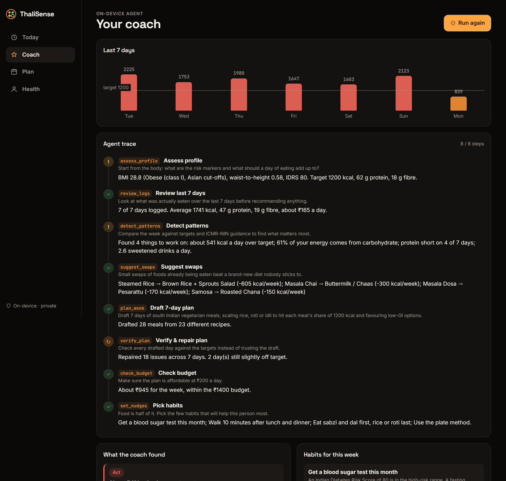
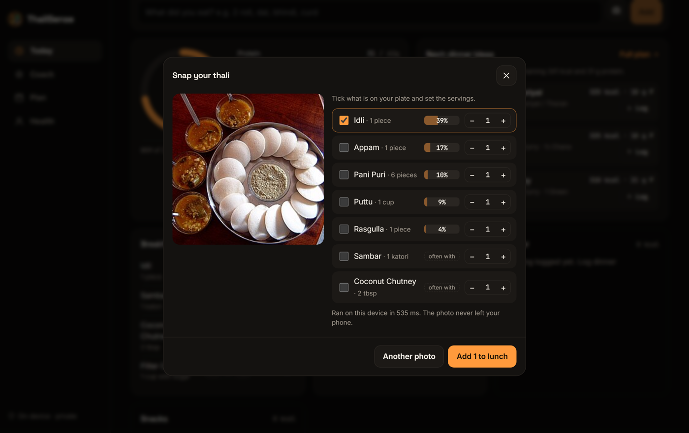
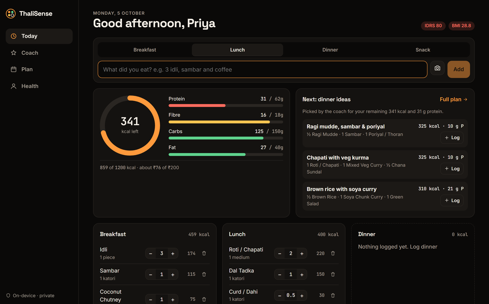
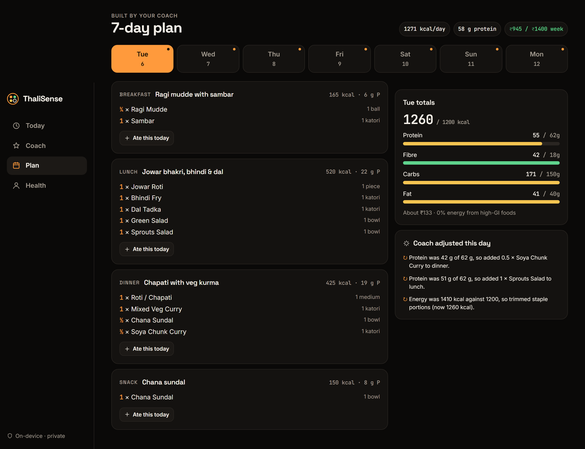
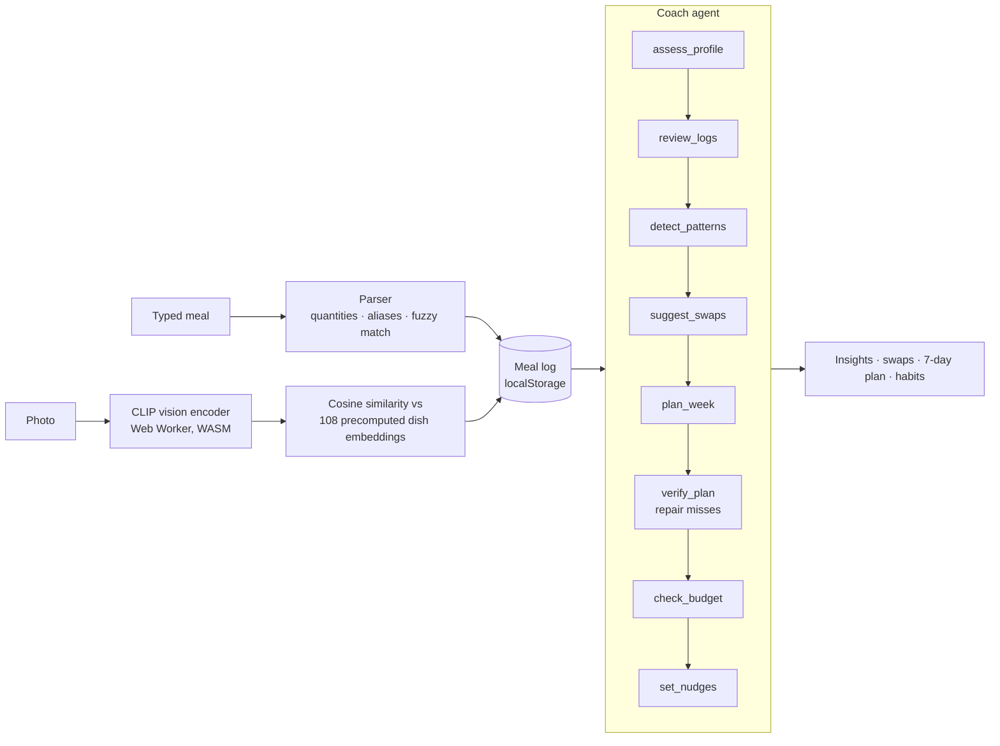

# ThaliSense

**An on-device AI nutrition and metabolic-health coach built for Indian meals.**

Type “2 roti, dal, bhindi” or snap your thali. ThaliSense works out what you ate, scores your diabetes risk with Indian-specific science, and an explainable agent plans a week of regional meals that fit your body, your diet and your budget. Nothing leaves your phone.

**Live demo: [thalisense.vercel.app](https://thalisense.vercel.app)** (press *Try with a demo week*)



| Snap your thali | Today | 7-day plan |
|---|---|---|
|  |  |  |

---

## Why

- **101 million** Indians live with diabetes and **136 million** more with prediabetes (ICMR-INDIAB, *Lancet Diabetes & Endocrinology*, 2023).
- South Asians develop diabetes at lower body weight, so Western BMI cut-offs and Western food apps miss them. Most calorie apps don't know what *pesarattu*, *bisi bele bath* or *kadhi* is, and can't read “do roti aur dahi”.
- Advice like “eat less rice” doesn't stick. Swaps for foods people already eat, in their own regional cuisine and at their budget, do.

## What it does

| | |
|---|---|
| **Log by typing** | “3 idli with sambar and coffee”, “do paratha aur dahi”, “rendu dosai”, “200g paneer”. Handles quantities, plurals, Hindi and Tamil number words, typos (“chappati”) and compound dishes (“curd rice” is not curd + rice). |
| **Log by photo** | A CLIP vision model runs **in the browser** and shortlists the dish; you tick what is on the plate and it offers the usual sides (idli → sambar, chutney). |
| **Know your risk** | Indian Diabetes Risk Score (MDRF), BMI with **Asian Indian cut-offs** (overweight from 23), waist-to-height ratio, and daily energy, protein and fibre targets. |
| **Coach agent** | Reviews the last 7 days, finds what matters most, suggests swaps, drafts a 7-day plan, **checks its own plan and repairs it**, checks the budget and picks habits. Every step is shown as a trace. |
| **7-day regional plan** | South, North, East or West Indian; vegetarian, eggetarian or non-veg; within your ₹/day budget. One tap logs a planned meal. |
| **Private by design** | No account, no server, no analytics. Profile and meals live in your browser; photos are processed locally. |

## How it works



**Dish recognition.** CLIP ViT-B/32 is a vision-language model that can match an image against any text label without retraining. We precompute text embeddings for every dish at build time ([`scripts/embed-labels.ts`](scripts/embed-labels.ts)), averaging four prompts per dish that describe what it looks like (“soft white round steamed rice cakes”). The browser then only downloads the 89 MB quantised vision encoder (cached after the first use) and each photo is a single forward pass, about 1 second on a laptop. The embeddings ship as 76 KB of int8 data.

Measured on 30 Wikipedia photos of Indian dishes: **70% top-1, 80% top-3**. Because the user confirms from a shortlist, top-3 is what matters, and a wrong guess costs one tap, not a wrong log.

**The agent** ([`src/lib/agent.ts`](src/lib/agent.ts)) is a deterministic, explainable planner rather than a chatbot, so it is fast, free, works offline, and never invents a number. It scores 60 real Indian meal templates on protein density, fibre, glycaemic load, fried and sugar share, cost, regional fit and variety; scales the staple (rice cups, roti or idli count) to each meal's calorie share; then verifies each day and repairs misses, adding protein boosters (soya, sprouts, curd, eggs) and trimming staples until the day is within range. Every action is logged to the trace the user sees.

## The science

| Measure | Source |
|---|---|
| Nutrition per serving | IFCT 2017, Indian Food Composition Tables (ICMR-NIN), and standard home recipes. Approximate by design. |
| Indian Diabetes Risk Score | Mohan V. et al., *JAPI* 2005 (Madras Diabetes Research Foundation): age, waist, activity, family history. 60+ is high risk. |
| BMI cut-offs | Misra A. et al., consensus statement for Asian Indians, *JAPI* 2009: normal 18.5–22.9, overweight 23–24.9, obese 25+. |
| Waist-to-height ratio | 0.5+ indicates central obesity (Ashwell et al., *Obesity Reviews* 2012). |
| Energy targets | Mifflin-St Jeor equation, 500 kcal deficit for weight loss, never below 1200 (women) / 1500 (men). |
| Macros | ICMR-NIN Dietary Guidelines for Indians 2024: carbohydrate around 50% of energy, fat at most 30%. |

ThaliSense is a wellness guide, **not a medical device**. It tells high-risk users to get a blood test and does not diagnose anything.

## Tech

React 19 · TypeScript · Vite · Transformers.js (ONNX Runtime Web) · CLIP ViT-B/32 · Vitest · Vercel. No backend, no API keys, no paid services.

## Run it

```bash
npm install
npm run dev        # http://localhost:5173
npm test           # engine, parser and agent tests
npm run build
```

To regenerate dish embeddings after editing the food list: `npx vite-node scripts/embed-labels.ts`.

## Project layout

```
src/data/foods.ts       108 dishes: nutrition, aliases, GI band, cost
src/data/templates.ts   60 real meal templates and swap rules
src/lib/parser.ts       free-text meal parser
src/lib/health.ts       BMI, waist-to-height, IDRS, targets
src/lib/agent.ts        coach agent with traceable tool steps
src/vision/             CLIP worker and precomputed label embeddings
src/components/         Today, Coach, Plan, Health screens
```

## Roadmap

- Multi-dish detection on a full thali (segment, then classify each katori)
- Voice logging in Hindi, Tamil, Bengali and Marathi
- Optional cloud LLM chat on top of the agent's trace, bring-your-own key
- Glucose-meter and step-count import; ASHA-worker mode for community screening

## License

MIT
