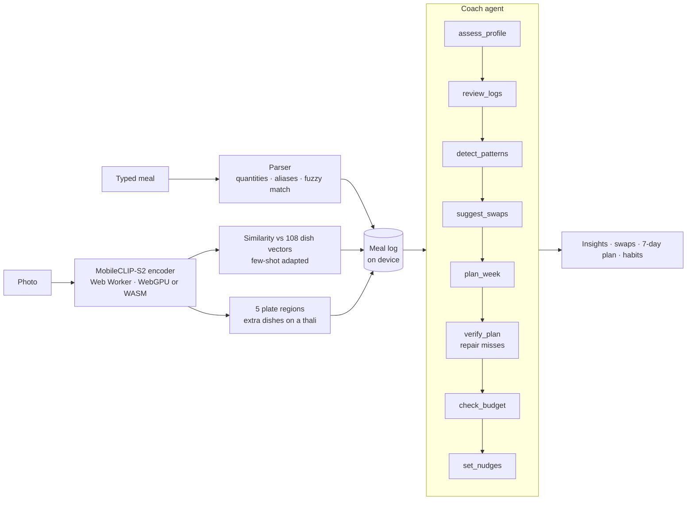

# ThaliSense

**An on-device AI nutrition and metabolic-health coach built for Indian meals.**

Type “2 roti, dal, bhindi” or snap your thali. ThaliSense works out what you ate, scores your diabetes risk with Indian-specific science, and an explainable agent plans a week of regional meals that fit your body, your diet and your budget. Nothing leaves your phone.

**Live app: [thalisense.vercel.app](https://thalisense.vercel.app)** (press *Try with a demo week*; installable, works offline) · **[Demo video](https://github.com/andringodson/ThaliSense/releases/latest)**


| Snap your thali | Today | 7-day plan |
|---|---|---|
|  |  |  |

---

## Why

- **101 million** Indians live with diabetes and **136 million** more with prediabetes (ICMR-INDIAB, *Lancet Diabetes & Endocrinology*, 2023).
- South Asians develop diabetes at a lower body weight, so Western BMI cut-offs and Western food apps miss them. Most calorie apps don't know what *pesarattu*, *bisi bele bath* or *kadhi* is, and can't read “do roti aur dahi”.
- Advice like “eat less rice” doesn't stick. Swaps for foods people already eat, in their own regional cuisine and at their budget, do.

## What it does

| | |
|---|---|
| **Log by typing** | “3 idli with sambar and coffee”, “do paratha aur dahi”, “rendu dosai”, “200g paneer”. Handles quantities, plurals, Hindi and Tamil number words, typos (“chappati”) and compound dishes (“curd rice” is not curd + rice). |
| **Log by photo** | A vision model runs **in the browser** and recognises the dish: **87.8% top-1, 95.0% top-3** on 1,694 test photos. On a thali it also scans regions of the plate and finds several dishes, then offers the usual sides (idli → sambar, chutney). |
| **Plate score** | Every logged and planned meal gets a 0–100 balance score from protein density, fibre, glycaemic load and fried or sweet share. |
| **Know your risk** | Indian Diabetes Risk Score (MDRF), BMI with **Asian Indian cut-offs** (overweight from 23), waist-to-height ratio, and daily energy, protein and fibre targets. |
| **Track progress** | Log weight and waist weekly; see both trends against the BMI-23 and half-your-height goals. Risk scores recompute instantly. |
| **Coach agent** | Reviews the last 7 days, finds what matters most, suggests swaps, drafts a 7-day plan, **checks its own plan and repairs it**, checks the budget and picks habits. Every step is shown as a trace. |
| **7-day regional plan** | South, North, East or West Indian; vegetarian, eggetarian or non-veg; within your ₹/day budget; real portions (never a quarter bowl). One tap logs a planned meal; share the week on WhatsApp. |
| **Private and offline** | No account, no server, no analytics. Install it to the home screen; it works offline once loaded. Profile, meals and photos stay on the device. |

## How it works



**Dish recognition** ([model card](docs/vision.md)). We benchmarked four vision-language models on 1,694 labelled photos from three public Indian-food datasets plus 30 Wikipedia photos, and shipped the best: **MobileCLIP-S2**, which is both more accurate and smaller than CLIP.

| Model | Download | Top-1 | Top-3 | Wikipedia top-1 |
|---|---|---|---|---|
| CLIP ViT-B/32 (v1.0) | 89 MB | 71.5% | 86.8% | 70.0% |
| CLIP ViT-B/16 | 87 MB | 73.6% | 87.9% | 73.3% |
| MobileCLIP-S2 | 72 MB | 81.5% | 92.9% | 80.0% |
| **MobileCLIP-S2 + few-shot adaptation** | **72 MB** | **87.8%** | **95.0%** | **80.0%** |

Each dish is one vector: four descriptive prompts per dish, averaged, then moved towards the mean embedding of real photos of that dish for the 40 dishes with training photos (with a modality-gap correction and a held-out class split to choose how far). Only the 72 MB image encoder downloads, once; each photo takes under a second on four WASM threads and much less on WebGPU. For whole thalis, scanning five plate regions **doubles the dishes found** (25% → 55% on 200 four-dish test plates). Everything is reproducible with [`scripts/vision`](scripts/vision).

**The agent** ([`src/lib/agent.ts`](src/lib/agent.ts)) is a deterministic, explainable planner rather than a chatbot, so it is fast, free, works offline, and never invents a number. It scores 60 real Indian meal templates on protein density, fibre, glycaemic load, fried and sugar share, cost, regional fit, variety and whether they fit the calorie target at sensible portions. It scales the staple (rice cups, roti or idli count) to each meal's share, then verifies each day: it adds protein boosters, trims staples and snacks, and if a day is still heavy it swaps in a lighter meal. Every action is logged to the trace the user sees.

## The science

| Measure | Source |
|---|---|
| Nutrition per serving | IFCT 2017, Indian Food Composition Tables (ICMR-NIN), and standard home recipes. Approximate by design. |
| Indian Diabetes Risk Score | Mohan V. et al., *JAPI* 2005 (Madras Diabetes Research Foundation): age, waist, activity, family history. 60+ is high risk. |
| BMI cut-offs | Misra A. et al., consensus statement for Asian Indians, *JAPI* 2009: normal 18.5–22.9, overweight 23–24.9, obese 25+. |
| Waist-to-height ratio | 0.5+ indicates central obesity (Ashwell et al., *Obesity Reviews* 2012). |
| Energy targets | Mifflin-St Jeor equation, 500 kcal deficit for weight loss, never below 1200 (women) / 1500 (men). |
| Macros | ICMR-NIN Dietary Guidelines for Indians 2024: carbohydrate around 50% of energy, fat at most 30%. |

ThaliSense is a wellness guide, **not a medical device**. It tells high-risk users to get a blood test and does not diagnose anything.

## Quality

- **17 unit tests** (Vitest): food data integrity, Asian BMI and IDRS scoring, the parser (Hinglish, Tamil, typos, grams), plate score ranking, and the agent across all 12 diet × region combinations (every day within 12% of target, no item under half a serving, no repeated items).
- **12 end-to-end tests** (Playwright, desktop and phone): typed logging, the coach run and plan, progress tracking, the manifest, a **WCAG 2 AA axe scan of every screen with no serious issues**, no horizontal overflow, and (locally) real photo recognition of a single dish and a four-dish thali.
- GitHub Actions runs unit tests, the build and the end-to-end tests on every push; Vercel deploys `main`.

## Tech

React 19 · TypeScript · Vite · Transformers.js (ONNX Runtime Web, WebGPU/WASM) · MobileCLIP-S2 · Vitest · Playwright + axe · GitHub Actions · Vercel. Cross-origin isolated for multi-threaded WASM; installable PWA with a service worker. No backend, no API keys, no paid services.

## Run it

```bash
npm install
npm run dev        # http://localhost:5173
npm test           # unit tests
npm run build
npm run e2e        # Playwright end-to-end tests against the production build
```

To rebuild the dish vectors after editing the food list, see [docs/vision.md](docs/vision.md#reproduce).

## Project layout

```
src/data/foods.ts       108 dishes: nutrition, aliases, GI band, cost
src/data/templates.ts   60 real meal templates and swap rules
src/lib/parser.ts       free-text meal parser
src/lib/health.ts       BMI, waist-to-height, IDRS, targets
src/lib/nutrition.ts    totals and plate score
src/lib/agent.ts        coach agent with traceable tool steps
src/vision/             vision worker and the 108 dish vectors
src/components/         Today, Coach, Plan, Health screens
scripts/vision/         model benchmark, few-shot adaptation, thali test
tests/e2e/              Playwright tests
```

## Roadmap

- Segment the plate before classifying, for real thalis with overlapping katoris
- Voice logging in Hindi, Tamil, Bengali and Marathi
- Optional cloud LLM chat on top of the agent's trace, bring-your-own key
- Glucose-meter and step-count import; ASHA-worker mode for community screening

## Credits

The idli photo in the screenshots and tests is [Idli_Sambar.JPG](https://commons.wikimedia.org/wiki/File:Idli_Sambar.JPG) by Soumya dey (CC BY-SA 3.0). Test fixture credits are in [tests/e2e/fixtures](tests/e2e/fixtures/README.md). Dataset sources are listed in the [model card](docs/vision.md#data).

## License

MIT for the code. Photos keep their own licenses as credited above.
